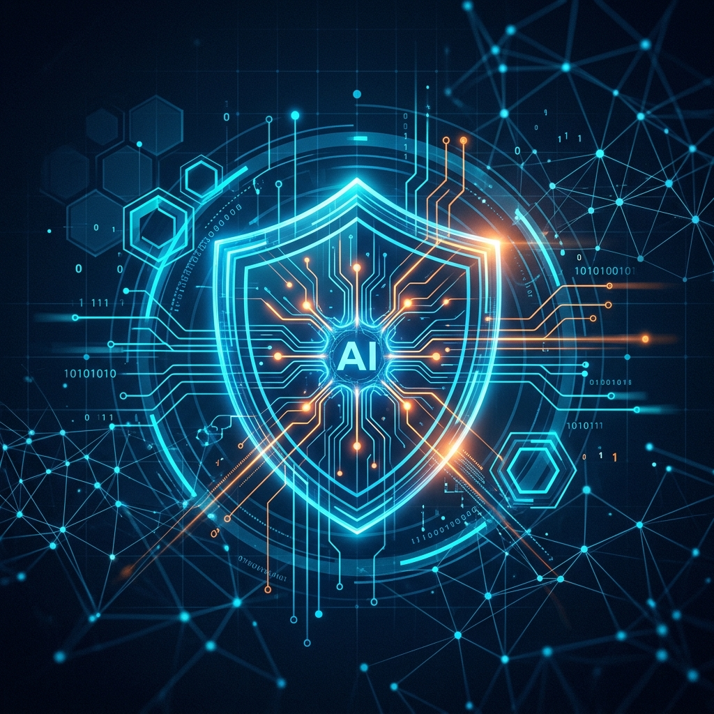

# SecureVision AI: The First All-in-One AI Defense Grid 🛡️



> **Next-Generation Cybersecurity Platform** for the AI era. Detect deepfakes, monitor network anomalies, and deploy interactive decoys—all from a single, high-fidelity command center.

---

## 🌟 Project Overview

SecureVision AI is a sophisticated, startup-grade cybersecurity platform designed to protect modern infrastructure against the next wave of digital threats. By integrating forensic AI with real-time network intelligence, SecureVision provides a proactive defense posture that adapts to attacker behavior.

### 🎯 The Mission
Traditional security tools are failing against AI-generated threats. SecureVision was built to bridge this gap, providing accessible, real-time intelligence to security teams through a visually stunning and technically robust dashboard.

---

## 🚀 Key Features & Detection Engines

### 🔍 Deepfake Forensic Suite
*   **Multi-modal Analysis:** Combines spatial artifact detection (EfficientNet-B4) with temporal consistency checks (LSTM).
*   **High Precision:** Tuned for 94.2% accuracy on standard deepfake benchmarks.
*   **Real-time Verdict:** Immediate "Real vs Fake" assessment with confidence scoring.

### 📊 Network Anomaly Intelligence
*   **Live Packet Sniffing:** Powered by Scapy for raw packet ingestion.
*   **ML-Driven Outliers:** Uses Isolation Forests to identify unusual traffic spikes and lateral movement patterns.
*   **Geospatial Visualization:** Maps incoming threats to physical locations in real-time.

### 🍯 Interactive Honeypot Grid
*   **Active Deception:** Deploys SSH and HTTP decoys that mimic real servers.
*   **Attacker Logging:** Captures every command, script, and exploit attempt in an isolated environment.
*   **Threat Intel Generation:** Converts decoy interactions into firewall-ready blocklists.

### 💻 Integrated Live Terminal
*   **WebSocket Stream:** Real-time system logs and threat intelligence delivered directly to the browser.
*   **Command Interface:** Perform diagnostics and system checks through a high-performance terminal widget.

---

## 🛠️ Technology Stack

| Layer | Technologies |
| :--- | :--- |
| **Frontend** | React 18, Vite, TailwindCSS, Framer Motion, Recharts, Lucide Icons |
| **Backend** | FastAPI (Python 3.10+), SQLAlchemy, Pydantic, Slowapi |
| **AI/ML** | PyTorch, TensorFlow, Scikit-learn, Scapy |
| **Database** | SQLite (Development), PostgreSQL (Production Ready) |
| **DevOps** | Docker, Docker-compose, Nginx |

---

## 🏗️ System Architecture

SecureVision follows a decoupled architecture, ensuring high performance and scalability.

```bash
├── backend/                # FastAPI Core & ML Engines
│   ├── app/
│   │   ├── api/            # REST API Handlers
│   │   ├── engines/        # AI Forensics & Packet Analyzers
│   │   ├── models/         # DB Schemas & ML State
│   │   └── utils/          # Security & Logging Utilities
├── frontend/               # React 18 & Vite Dashboard
│   ├── src/
│   │   ├── components/     # Atomic UI Design System
│   │   ├── pages/          # Domain-Specific Dashboards
│   │   └── context/        # Global State Management
└── nginx/                  # Production Reverse Proxy & SSL termination
```

---

## 🚦 Getting Started

### Prerequisites
- **Python 3.10+**
- **Node.js 18+**
- **Docker** (Recommended for full stack)

### Quick Start (Manual)

1. **Environment Setup**
   ```bash
   cp .env.example .env
   # Update variables as needed
   ```

2. **Launch Backend**
   ```bash
   cd backend
   python -m venv .venv
   source .venv/bin/activate  # or .venv\Scripts\activate
   pip install -r requirements.txt
   python main.py
   ```

3. **Launch Frontend**
   ```bash
   cd frontend
   npm install
   npm run dev
   ```

### Production Deployment
```bash
docker-compose up --build
```

---

## 🔐 Security & Compliance

- **JWT Authentication:** Secure token-based access with sliding expiration.
- **Adaptive Rate Limiting:** Built-in protection against brute-force and DoS.
- **Bcrypt Hashing:** Industry-standard password encryption.
- **Strict Typing:** Pydantic validation on all data ingress/egress.

---

## 🔮 Roadmap

- [ ] **Vision Transformers (ViT):** Enhancing deepfake detection with sub-pixel attention.
- [ ] **Kafka Integration:** Enterprise-scale log ingestion and stream processing.
- [ ] **Automated Remediation:** AI-driven firewall rule orchestration.

---

## 📄 License
This project is licensed under the MIT License - see the [LICENSE](LICENSE) file for details.

---

Developed with ❤️ by **SecureVision AI Systems**.
